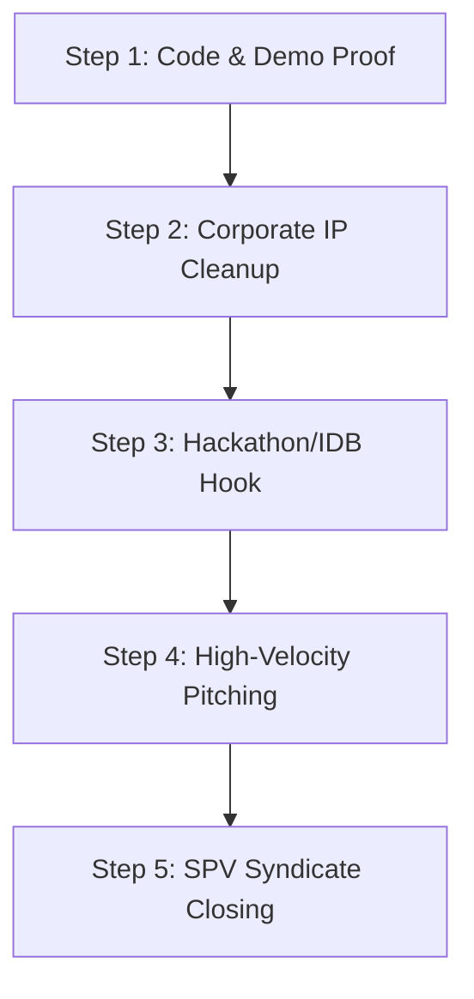

# Pacto Seco — Guaranteed Pre-Seed Fundraising Blueprint (PRIVATE)

*Internal strategic execution plan. Outlines the ironclad, step-by-step blueprint designed to maximize investor conviction, eliminate due diligence friction, and secure the $500,000 pre-seed SAFE check in under 30 days.*

---

## The Irrefutable Pitch Formula

To guarantee a successful raise, your pitch must immediately prove **four structural advantages** that place you in the top 1% of pre-seed startups:
1. **Working Technology (Not a PowerPoint)**: Show a fully functional parametric contract that has already processed real Copernicus satellite greenness and precipitation data on the 2023 Dry Corridor El Niño event, passing 22 local anvil tests.
2. **CapEx Efficiency over Cloud OpEx**: Turn your $230,000 hardware cluster request into an investor selling point. Show VCs that investing once in dual local EPYC and DGX workstations eliminates ongoing $10k+/month cloud processing bills, driving high software profit margins.
3. **Local Institutional Backing**: Prove you have an active research pathway to the Inter-American Development Bank (IDB) country offices through Juan Carlos at UNAH.
4. **Regulatory De-risking**: Show that Pacto Seco is strictly a *consensus trigger layer*—not a wallet or custodian. The actual fiat distribution is routed through a licensed Honduran mobile-money payer, bypassing CNBS Resolution 003/2024 crypto restrictions.

---

## Step-by-Step Execution Schedule

### Step 1: Code Cleanliness & "Irrefutable Proof" (Days 1–3)
*   **Objective**: Lock down the technical evidence so VCs cannot challenge your execution capability.
*   **Actions**:
    1. Clean the `/pacto-seco` repository. Ensure it contains a professional, technical `README.md` explaining the Sentinel-2 NDVI + ERA5 SPI-3 multi-sensor consensus logic.
    2. Record a **3-minute screen-share walkthrough video** showing:
       * Satellites fetching raw data.
       * The local contract recomputing Copernicus product IDs.
       * The 2-sensor consensus logic successfully resolving.
       * A simulated API call to the Stellar Disbursement Platform (SDP) off-ramp.
    3. Host the passing 22 anvil test logs in a secure folder.
*   **Deliverable**: A shareable, private GitHub repository link + a secure demo video link.

### Step 2: IP Assignment & Corporate Prep (Days 3–5)
*   **Objective**: Ensure the investment vehicle is legally bulletproof before opening investor discussions.
*   **Actions**:
    1. Sign a standard **IP Assignment Agreement** transferring all Pacto Seco codebase and architecture rights from you personally to your active **Delaware C-Corp**.
    2. Generate a standard **Post-Money SAFE Template** set at a **$5,000,000 Valuation Cap** (10% dilution for the $500,000) using your C-Corp's legal parameters.
*   **Deliverable**: Legal IP assignment executed + active corporate bank account ready for wires.

### Step 3: Launch the Hackathon & IDB Hook (Days 5–7)
*   **Objective**: Use your Taikai validation to bypass traditional cold-email walls.
*   **Actions**:
    1. Draft a structured progress update and email it directly to the CopernicusLAC organizers, the Taikai judges, and the IDB country-office contacts.
    2. **The Message**: *"We have successfully validated the Copernicus self-executing coordination kernel. We are now opening a $500,000 pre-seed SAFE to establish our dedicated local data processing cluster and initiate the live Honduras Dry Corridor pilot with UNAH."*
    3. Request warm introductions to climate-tech and deep-tech micro-VCs from the judges who scored your project highly.
*   **Deliverable**: First wave of warm, high-credibility introductions secured.

### Step 4: Coordinated Angel & Micro-VC Campaign (Days 7–20)
*   **Objective**: Flood your pipeline with parallel investor meetings to create FOMO (Fear Of Missing Out).
*   **Actions**:
    1. Target the curated list of 10 lead partners at **Humba Ventures**, **2048 Ventures**, and **Climate Collective** using the outreach copy in `SAFE_AND_OUTREACH.private.md`.
    2. Pitch the hardware cluster as a **highly efficient compute moat** that secures cheap, permanent processing power for municipal scale-up.
    3. Run all first-round investor meetings within a tight 7-day window. Keep the momentum high.
*   **Deliverable**: 5–10 initial pitch meetings scheduled and run.

### Step 5: SPV Syndicate Closing (Days 20–30)
*   **Objective**: Secure a lead check to pull in the remaining syndicate capital.
*   **Actions**:
    1. Secure a lead commitment of **$100,000 to $150,000** from a lead angel or micro-VC (e.g., Humba or an active climate-tech angel).
    2. Once the lead commits to the SAFE terms, package the remaining $350,000 allocation on **AngelList** or **Syndicate.io** as a Special Purpose Vehicle (SPV).
    3. Invite the remaining angels and syndicate members to co-invest. The rest of the round will close and wire in days.
*   **Deliverable**: $500,000 cleared in your Delaware C-Corp bank account.
